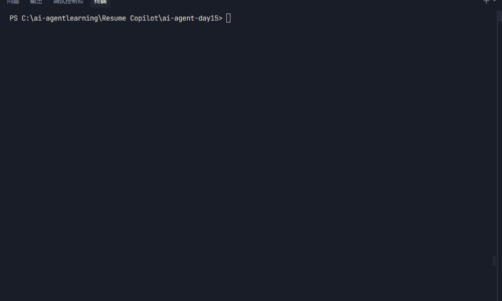

# Resume Copilot

## 🎬 Interactive CLI Demo



> AI 简历分析与优化 Agent，基于 LangGraph 状态机与大语言模型，帮助求职者快速识别简历与目标岗位 JD 的匹配度，并提供可交互的修改建议与局部重写能力。

---

## 目录

- [项目简介](#项目简介)
- [核心痛点](#核心痛点)
- [系统架构](#系统架构)
- [技术栈](#技术栈)
- [快速开始](#快速开始)
- [项目目录结构](#项目目录结构)
- [使用示例](#使用示例)
- [测试](#测试)
- [未来扩展规划](#未来扩展规划)
- [许可证](#许可证)

---

## 项目简介

**Resume Copilot** 是一款面向求职者的本地 AI Agent。它通过解析 PDF 简历、对比目标岗位描述（Job Description），自动生成结构化的匹配度分析报告，并支持多轮对话形式的简历优化。

项目的核心设计原则：

- **本地化优先**：PDF 与 Markdown 文件均在本地处理，保护隐私。
- **Human-in-the-loop**：最终修改由用户确认，避免完全自动化导致的内容失真。
- **模块化架构**：PDF 解析、LLM 分析、LangGraph 状态机、CLI 交互分层清晰，便于测试与扩展。

---

## 核心痛点

| 用户群体 | 痛点 | Resume Copilot 解决方案 |
| --- | --- | --- |
| 应届生 / 职场新人 | 不清楚 JD 看重的关键词，简历描述空泛 | 自动提取 JD 关键词并输出结构化短板分析 |
| 转行 / 跳槽候选人 | 过往经历与目标岗位不完全匹配 | 基于 LLM 生成经历改写建议，突出 transferable skills |
| 技术岗位求职者 | 项目描述过于技术化，缺乏业务价值表达 | 将技术细节转化为业务成果导向的描述 |
| 求职顾问 / 猎头 | 需要快速判断候选人与岗位匹配度 | 自动生成匹配度打分与优劣势报告 |

---

## 系统架构

```text
                    +------------------+
                    |      START       |
                    +--------+---------+
                             |
            +----------------+----------------+
            |                                 |
            | resume_raw_text 为空             | resume_raw_text 已存在
            |                                 |
            v                                 v
   +--------+--------+               +----------+-----------+
   |  parser_node    |               |     router_node      |
   |  解析 PDF 文本   |               | 意图分类 & 路由决策   |
   +--------+--------+               +----------+-----------+
            |                                 |
            v                                 |
   +--------+--------+                        |
   |  analyzer_node  |                        |
   | 生成匹配度报告   |                        |
   +--------+--------+                        |
            |                                 |
            v                                 v
   +--------+--------+          +----------------+----------------+
   |       END       |          |                |                |
   +-----------------+          v                v                v
                       +--------+--------+ +-----+------+ +-------+--------+
                       |  rewriter_node  | | qna_node   | | exporter_node  |
                       | 局部重写简历     | | 回答用户   | | 导出 Markdown  |
                       +--------+--------+ | 问题       | +-------+--------+
                                |          +-----+------+         |
                                |                |                |
                                +----------------+----------------+
                                                 |
                                                 v
                                        +--------+---------+
                                        |       END        |
                                        +------------------+
```

### 工作流说明

1. **首次上传**：`START` 检测到 `resume_raw_text` 为空，进入 `parser -> analyzer` 流程，生成分析报告。
2. **后续交互**：根据用户最新消息的意图，`router_node` 决定走向：
   - `rewrite` → `rewriter_node` 局部重写 Markdown 简历
   - `export` → `exporter_node` 导出 Markdown 文件
   - `chat` → 直接结束当前轮，由上层 CLI 展示默认提示
3. **状态持久化**：使用 LangGraph `MemorySaver` 保存会话状态，支持同一 `thread_id` 下的多轮对话。

---

## 技术栈

| 层级 | 技术 |
| --- | --- |
| 编程语言 | Python 3.10+ |
| Agent 框架 | LangGraph + LangChain |
| LLM 调用 | OpenAI API / DeepSeek API / 兼容 OpenAI 接口的服务 |
| 结构化输出 | Pydantic v2 |
| PDF 解析 | pypdf |
| 配置管理 | pydantic-settings + python-dotenv |
| 日志 | loguru |
| CLI 美化 | rich |
| 测试 | pytest |

---

## 快速开始

### 1. 克隆与安装

```bash
# 创建并激活虚拟环境（推荐）
python -m venv .venv
source .venv/bin/activate  # Windows: .venv\Scripts\activate

# 以 editable 模式安装，包含开发依赖
pip install -e ".[dev]"
```

### 2. 配置环境变量

```bash
cp .env.example .env
```

编辑 `.env`：

```env
OPENAI_API_KEY=sk-your-api-key
OPENAI_BASE_URL=https://api.openai.com/v1
MODEL_NAME=gpt-4o-mini
LOG_LEVEL=INFO
```

> 如果你使用 DeepSeek，将 `OPENAI_BASE_URL` 改为 `https://api.deepseek.com/v1`。

### 3. 准备简历与 JD

- 将 PDF 简历放入 `data/` 目录（默认读取 `data/sample_resume.pdf`）。
- 准备目标岗位 JD 文本，可直接粘贴或保存为 `.txt` 文件。

### 4. 运行 CLI

```bash
python main.py
```

按提示输入 PDF 路径和 JD 后，Agent 将自动解析、分析并进入多轮交互模式。

---

## 项目目录结构

```text
Resume Copilot/
├── data/                       # 输入 PDF 简历与 JD 示例
│   ├── .gitkeep
│   ├── ai开发JD.txt
│   ├── sample_resume.pdf
│   └── 刘彭果简历.pdf
├── docs/
│   ├── architecture_review.md  # 架构评审文档
│   ├── code_review.md
│   ├── demo.gif
│   └── spec.md                 # 系统需求与设计规范
├── outputs/                    # 生成的 Markdown 简历与日志
│   ├── .gitkeep
│   ├── logs/
│   └── resume_20260801_015839.md
├── src/resume_copilot/
│   ├── __init__.py
│   ├── cli.py                  # Rich 交互式 CLI
│   ├── config.py               # pydantic-settings 配置
│   ├── logger.py               # loguru 日志配置
│   ├── analyzers/
│   │   ├── __init__.py
│   │   └── resume_analyzer.py  # LLM 简历分析器
│   ├── graph/
│   │   ├── __init__.py
│   │   ├── nodes.py            # LangGraph Node 实现
│   │   ├── state.py            # AgentState 定义
│   │   └── workflow.py         # StateGraph 构建
│   ├── models/
│   │   ├── __init__.py
│   │   └── analysis.py         # AnalysisReport Pydantic 模型
│   ├── parsers/
│   │   ├── __init__.py
│   │   └── pdf_parser.py       # PDF 解析器
│   └── utils/
│       └── __init__.py
├── tests/                      # pytest 测试套件
│   ├── __init__.py
│   ├── test_analyzer.py
│   ├── test_config.py
│   ├── test_graph.py
│   ├── test_nodes.py
│   └── test_parser.py
├── .env.example
├── .gitignore
├── main.py                     # CLI 入口
├── pyproject.toml
└── README.md
```

---

## 使用示例

### CLI 交互流程

```text
🚀 Resume Copilot
   AI 简历分析与优化 Agent

输入 help 查看可用指令，输入 exit 或 quit 退出程序。

📄 PDF 简历路径 [data/sample_resume.pdf]:
🎯 目标岗位 JD（可直接粘贴文本，或输入 .txt 文件路径）:

正在解析简历与匹配 JD...
✅ 简历解析与匹配分析完成

📊 匹配得分
综合匹配度：78/100

# Resume Analysis Report
...

────────────────────────────────────────
💬 请输入指令: 把项目2用 STAR 法则重写
Agent 正在处理...
✏️ 简历已根据您的要求重写：

# Updated Resume
...

────────────────────────────────────────
💬 请输入指令: 导出简历
Agent 正在处理...
📁 简历已成功导出到 outputs/ 目录
```

### 程序化调用

```python
from langgraph.checkpoint.memory import MemorySaver
from langchain_core.messages import HumanMessage
from resume_copilot.graph import build_resume_graph

graph = build_resume_graph(checkpointer=MemorySaver())
config = {"configurable": {"thread_id": "user-1"}}

# Phase 1: 解析 + 分析
result = graph.invoke(
    {
        "pdf_path": "data/sample_resume.pdf",
        "target_jd": "AI Agent Engineer with LangGraph experience.",
        "messages": [],
    },
    config,
)

# Phase 2: 重写
result = graph.invoke(
    {"messages": [HumanMessage(content="用 STAR 法则优化项目经历")]},
    config,
)

# Phase 3: 导出
result = graph.invoke(
    {"messages": [HumanMessage(content="导出简历")]},
    config,
)
```

---

## 测试

```bash
python -m pytest
```

项目包含 51 个单元与集成测试全部通过 (51 passed in 4.06s)，覆盖：

- 配置加载与日志输出 (`test_config.py`)
- PDF 解析与异常处理 (`test_parser.py`)
- `AnalysisReport` 模型校验与 `ResumeAnalyzer` 集成 (`test_analyzer.py`)
- LangGraph 各 Node 的状态更新 (`test_nodes.py`)
- 完整工作流生命周期与 `MemorySaver` 持久化 (`test_graph.py`)

---

## 未来扩展规划

| 功能 | 规划阶段 |
| --- | --- |
| 多用户登录 / 鉴权系统 | Phase 2+（Web 服务化时引入） |
| 真实招聘网站 JD 爬虫 | Phase 2+（合规评估后插件化） |
| 复杂 PDF 渲染排版引擎 | Phase 2+（目前仅输出 Markdown） |
| Web UI（Gradio / Streamlit） | Phase 4+ |
| 简历版本历史与对比 | Phase 5+ |
| 多语言简历支持 | Phase 5+ |

---

## 许可证

[MIT](LICENSE)
